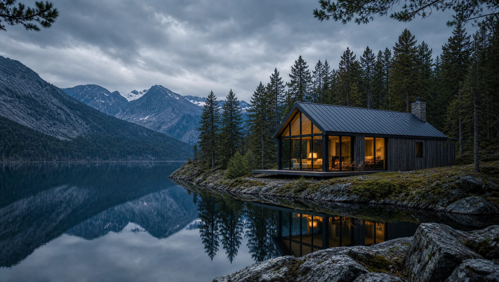
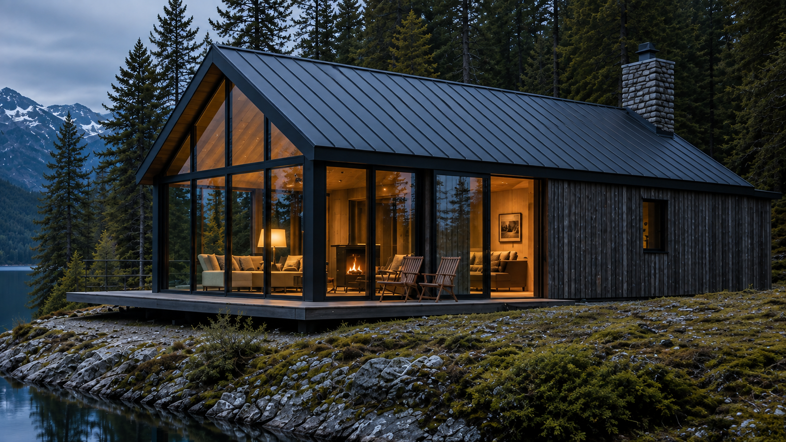
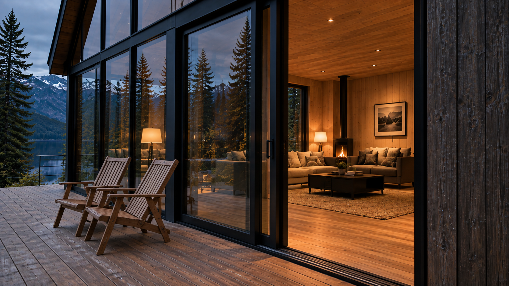
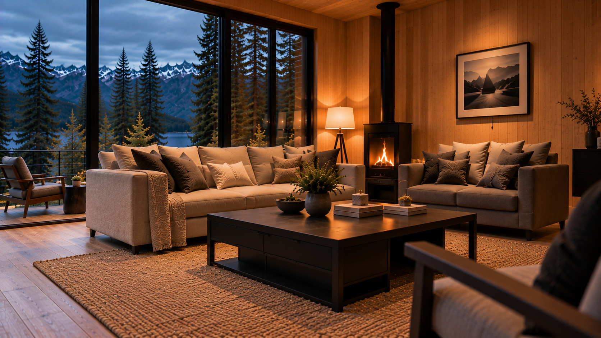
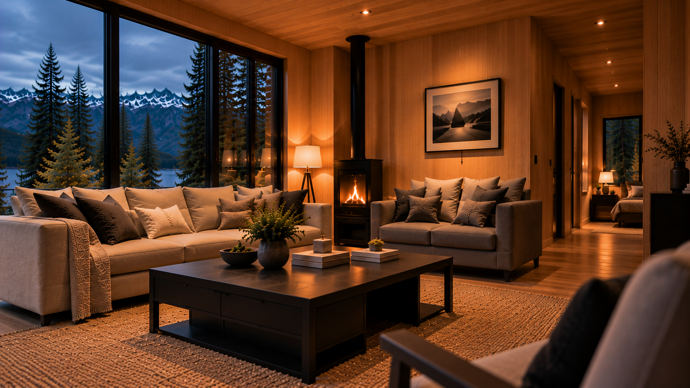
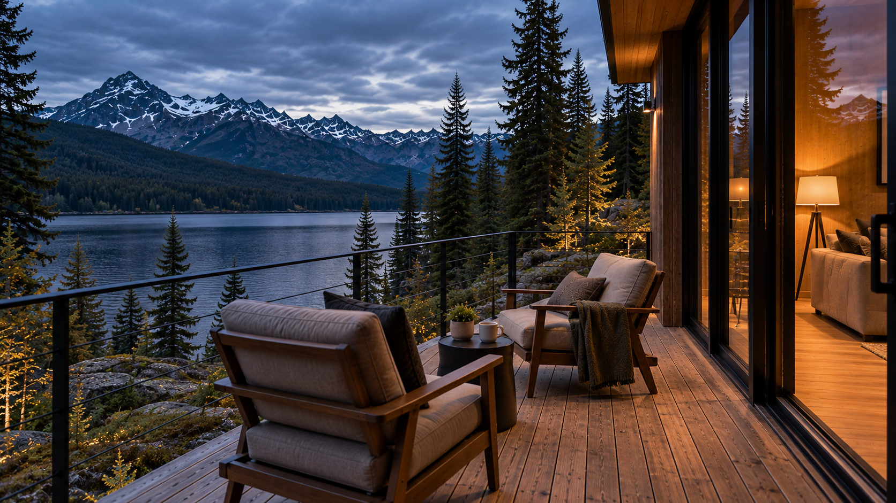
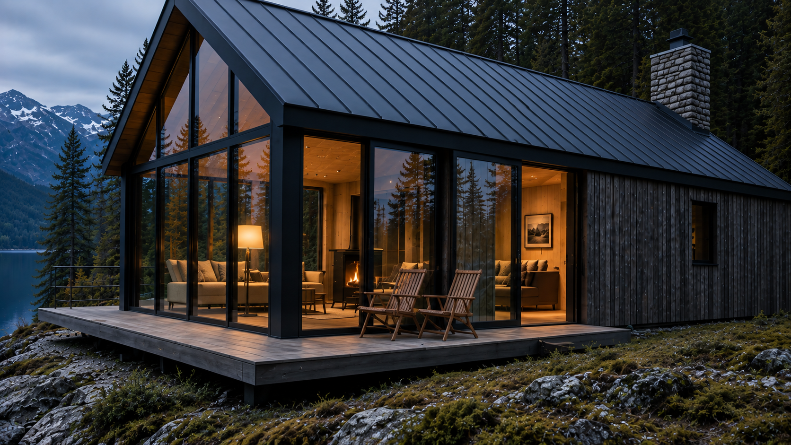
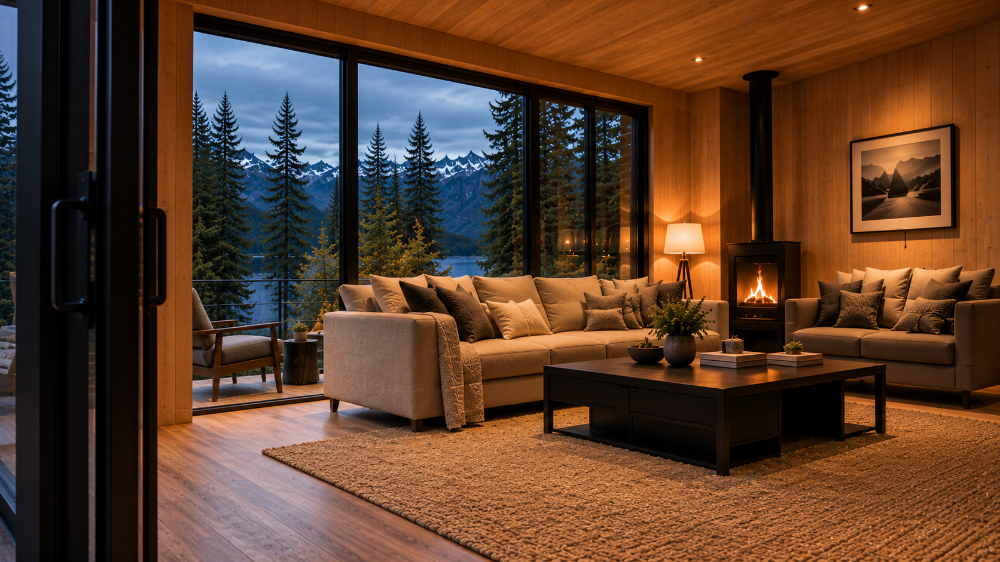

<div align="center">

# NORTHVALE

### A little closer to nowhere.

An immersive digital experience for a fictional secluded cabin retreat —  
designed and developed as a showcase of modern web design, interaction and visual storytelling.

<br />

[Live Experience]([YOUR_LIVE_URL_HERE](https://northvale-two.vercel.app/)) · [About the Project](#about-the-project) · [Tech Stack](#tech-stack)

</div>

<br />



---

## About the project

**Northvale** is a fictional hospitality concept created as a design and development showcase.

The goal was not simply to build a landing page, but to create a digital experience that makes the visitor feel like they are approaching the cabin before they ever arrive.

The experience begins with a quiet lakeside establishing shot and gradually moves closer to the property through a scroll-driven visual journey — from the surrounding landscape, across the terrace and through the entrance, before arriving inside the living room.

Every part of the project was designed around atmosphere, restraint and continuity.

> This is a fictional concept project. Northvale does not represent a real property, accommodation provider or client.

<br />

## The experience



The opening experience uses scroll progression as part of the storytelling rather than treating scrolling only as navigation.

The original hero gradually reframes toward the cabin while interface elements disappear, transitioning the visitor from a traditional website into a more cinematic sequence.

The visual journey follows a physically connected path:

**Lake → Cabin → Terrace → Entrance → Living Room**

Rather than presenting unrelated renders, the sequence was developed around a consistent cabin identity, camera direction, architecture, lighting and interior layout.

<br />



<br />

## Designed for continuity

One of the main challenges behind Northvale was maintaining the illusion that every frame belongs to the same physical place.

The cabin keeps the same defining architecture throughout the experience:

- Dark vertical timber exterior
- Charcoal standing-seam gabled roof
- Full-height glazed end gable
- Slim black structural window divisions
- Lakeside timber terrace
- Warm timber interior
- Restrained fireplace and practical lighting
- Cool mountain-lake environment

The transition from exterior to interior was treated as a continuous spatial journey rather than a collection of independent scenes.

<br />



<br />

## Interaction & motion

Northvale explores how motion can support storytelling without overwhelming the interface.

The experience combines:

- Scroll-driven image progression
- Cinematic reframing and scale
- Controlled content reveals
- Responsive image composition
- Desktop and portrait-specific framing
- Reduced-motion considerations
- Accessible interactive states
- Subtle transitions between editorial and functional sections

The objective was to make the motion feel intentional and architectural — not decorative.

<br />

## Visual direction

Northvale uses a restrained visual system inspired by Scandinavian cabins, editorial hospitality websites and architectural photography.

### Typography

**Cormorant Garamond** — display typography and wordmark  
**Manrope** — navigation, interface and body copy

### Palette

| Color | Hex | Purpose |
| --- | --- | --- |
| Warm Ivory | `#F2EFE5` | Primary light tone |
| Deep Pine | `#17221F` | Primary dark green |
| Dark Ink | `#101A18` | Deep interface tone |
| Soft Stone | `#D0D1C7` | Secondary neutral |
| Muted Amber | `#BF976A` | Restrained warm accent |

Large photography, generous negative space, thin rules and understated controls keep the interface secondary to the environment.

<br />

## Beyond the walkthrough



The visual language established during the opening journey continues throughout the rest of the experience.

Instead of switching to a generic booking interface, later sections continue using the same photography, typography, spacing and atmosphere established by the hero.

Supporting imagery was created for the booking experience, interior details, terrace, landscape and lifestyle moments.

<br />



<br />

## Tech stack

Northvale was designed and developed as a modern responsive web experience.

### Core

- Next.js
- React
- TypeScript
- CSS
- Responsive image optimization

### Experience

- Scroll-driven interactions
- Responsive cinematic layouts
- Accessible dialogs and navigation
- Reduced-motion support
- Custom locally hosted typography
- Optimized WebP image delivery

The implementation focuses on keeping the experience visually rich without sacrificing responsiveness, accessibility or maintainability.

<br />

## Responsive by design

The desktop composition uses the width of the landscape to establish scale and isolation, while portrait layouts intentionally reframe the same experience rather than simply shrinking the desktop version.

Important visual subjects remain readable across viewport sizes, and alternate compositions are used where the cinematic framing requires them.

<br />

## Selected frames

| Approach | Threshold |
| :---: | :---: |
|  |  |

| Interior | Landscape |
| :---: | :---: |
|  |  |

<br />

## Running locally

Clone the repository:

```bash
git clone YOUR_REPOSITORY_URL
cd northvale
```

Install dependencies:

```bash
npm install
```

Start the development server:

```bash
npm run dev
```

Open `http://localhost:3000` in your browser.

<br />

## Project purpose

Northvale was created to explore the intersection of:

**web development · interaction design · visual storytelling · hospitality design**

It is a portfolio project intended to demonstrate the process of taking a fictional brand from visual direction to a polished, responsive digital experience.

The concept, interface and implementation were created specifically for this showcase.

<br />

## License

The source code in this repository is available under the [MIT License](LICENSE).

Northvale is a fictional concept project created for portfolio and demonstration purposes. Project-specific branding, visual identity, photography, generated imagery and other creative assets are not covered by the MIT License and may not be reused or redistributed without permission.

© 2026 Hamza Čutuna. All rights reserved for project-specific creative assets.

---

<div align="center">

### NORTHVALE

*A little closer to nowhere.*

<br />

Designed & developed as an independent concept project.

</div>
